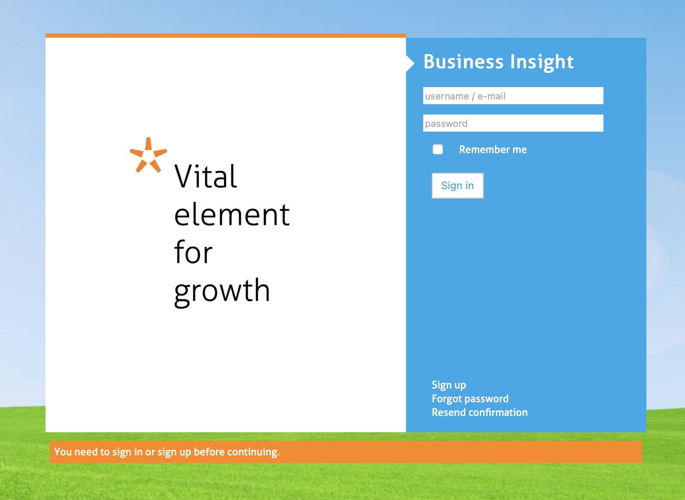
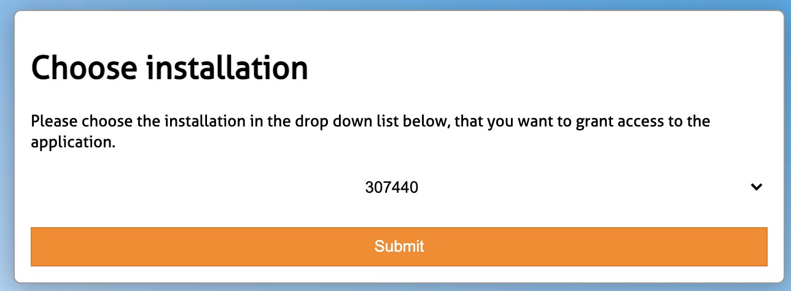
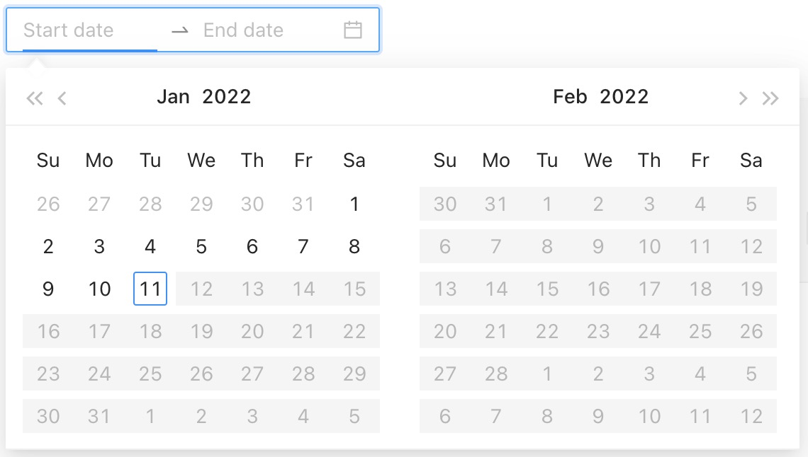
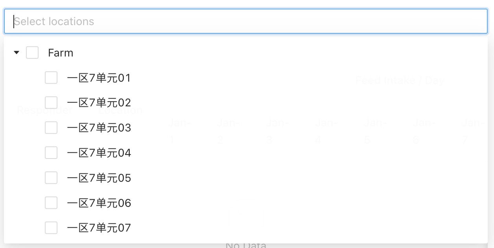

# Nedap Live Data Tracker Guide

## 1. What is **Nedap Live Data Tracker**?

Live Data Tracker is a online tool to trace, anaylsis and export the historical records of livestocks in the farms using technology from Nedap China Ltd.

## 2. What can **Nedap Live Data Tracker** do?

Currently, this tool supports search by following criteria,
- Date Interval (i.e. 2021-01-01 to 2021-02-01);
- Location ID (i.e. 测定站1单元1栏);
- Weight Interval (i.e. 30 <= \$current_weight\$ <= 40);  **\*\*comming soon\*\***

and then export to csv for local references. 

## 3. User Guide

1. Sign up a Nedap Account [here](https://connect.nedap-livestockmanagement.com/get-started/data-permission/), follow the step-by-step instruction.

2. Once you recevied an email confirmation, go to [Nedap Live Data Tracker](https://www.nedap-pigdata.cn/), and enter your username and password.

    

3. Once logged in, you can select a farm from installation list to access the farm.

    

4. Start filling in **Date** and **Location**, then click **Search**.

    

    

5. Then you will get detailed tables and ~~charts~~ of:
    - Feed intake (kg) per day
    - Weight (kg) per day
    - Total Feed Intake, Weight Delta, FCR comparison. 

## 4. Installation
0. Before Start
Before start, you should run:

    `yarn install`

    to install all the dependencies the app relies on.

1. Start
To run the app in the development mode, you should run:

    `yarn start`

    Then open [http://localhost:3000](http://localhost:3000) to view it in the browser.
    
    The page will reload if you make edits.
    
    You will also see any lint errors in the console.

2. Usage
    To use the app, you should attach a query parameter named `accessToken` in the queries of the url, for example:

    [http://domain?accessToken=your_access_token](http://localhost:3000?accessToken=your_access_token)

    Then the app can use the access token to retrieve data.

3. Deploy

    To build the app for production to the `build` folder, you should run:

    `yarn build`

    It correctly bundles React in production mode and optimizes the build for the best performance.

    The build is minified and the filenames include the hashes.

    Your app is ready to be deployed!

    See the section about [deployment](https://facebook.github.io/create-react-app/docs/deployment) for more information.

## 5. More Info
- Nedap API Authorization & Authentication: [Nedap API Guide](https://connect.nedap-livestockmanagement.com/api-guide/);
- Nedap API specification: [Nedap API Reference](https://api.nedap-bi.com/api/redoc/).

